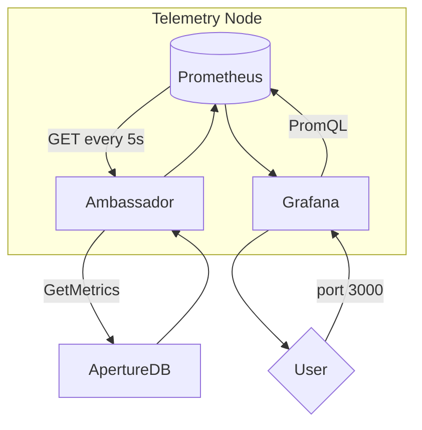
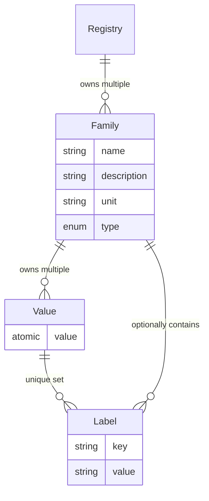

# Aperture DB Operational Metrics and Telemetry

This is a development guide for operational metrics exposed by ApertureDB.

## Definitions

### Operational Metric

* An **operational metric** is any single numeric value that can be evaluated while ApertureDB is operating. Operational metrics are evaluated repeatedly, and their values are stored as a time series.

* *Note:* This is not to be confused with the `AddDescriptorSet` parameter `metric`. This refers to a **distance metric**, which is an unrelated concept. For the remainder of this document, we use the term *metric* to mean operational metric.

### Telemetry

* **Telemetry** is the process of collecting metric values and persisting them externally.

### Statistic

* A **statistic** is any result that can be computed based on one or more metrics. Statistics differ from metrics in that statistics need not be directly measureable. For example, given a matric that counts every time a particular event occurs, we can use this metric compute a statistic describing the rate at which that event occurs per second. In general, we do not present raw metrics to users directly, and instead use them to compute statistics that are more intuitive and/or informative.

### Metric Types

* Metrics come in the following types, in order of increasing complexity.

* *Note:* Our metric types mirror those defined by [Prometheus](https://prometheus.io/docs/concepts/metric_types/).

#### Counter

* A **counter** is a single numeric value that only ever increases over time. Counters are suitable for tasks such as counting discrete events as they happen or tracking the consumption of a resource (eg. time spent). Generally, the value of a counter is less interesting than its rate of change. Counters are appropriate for both discrete and continuous use cases, though they are internally represented as floating-point[*](#typed-metric-values).

#### Gauge

* A **gauge** is a single numeric value that can increase or decrease. Gauges typically represent measured values such as memory usage or file size.

#### Histogram

* A **histogram** is a collection of values that collectively describe a distribution of numerical observations. A histogram records the total count of observations, the sum of all observed values, and a distribution of observations into **buckets** delineated by value. The number and range of histogram buckets are static and configurable. Histograms are generally suitable for discrete operations with variable size such as query latency or payload size.

#### Summary

* A **summary** is similar to a histogram but tracks $\phi$-quantile values instead of bucket counts. A **$\phi$-quantile** *(0 $\le$ $\phi$ $\le$ 1)* describes a value *v$\phi$* at which $\phi*n$ of the last *n* observed values were less than *v$\phi$*. The *$\phi$* values and history length *n* for a summary are static and configurable. Summaries also track observation count and sum just like histograms.

* Summaries are more expensive to observe than histograms due to having to maintain the observation history and compute the quantile values. Additionally, *summaries cannot be aggregated*, while histograms can. As such, the only real advantage summaries have over histograms is the ability to retrieve *precise* quantile values (quantile values can be estimated using histograms).

## Implementation

### Components

We employ a collection of microservices to collect, persist, and vistualize oprational data. By default, we deploy these services to a single node which we call the **Telemetry Node**.

#### Prometheus

* [Prometheus](https://prometheus.io/docs/introduction/overview/) is a Time Series Database (TSDB) service that persists our telemetry data. It requests telemetry data from the Ambassador at a regular interval (5s by default). Prometheus provides an API using its own query language [PromQL](https://prometheus.io/docs/prometheus/latest/querying/basics/).

#### Ambassador

* The **Ambassador** (aka. "Prometheus Ambassador") is an internally-developed microservice that queries metric values from an ApertureDB instance to service a request from Prometheus. It is little more than an API conversion layer.

#### ApertureDB

* The **ApertureDB** instance from which we are collecting telemetry.

#### Grafana

* [Grafana](https://grafana.com/docs/grafana/latest/introduction/) is a web UI for  telemetric statistics. Users develop dashboards to visualize statistics that are defined in PromQL and populated from [Prometheus](#prometheus). New ApertureDB telemetry deployments come with some default dashboards for common statistics.

### Data Model

#### Registry

* The `MetricsRegistry` is a singleton owned by the athena service that manages the current metric state.  The `MetricsRegistry` is required in order to create or query[*](#efficient-lookup) `Family`s.

#### Family

* A `Family<T>` where `T` is a [metric type](#metric-types) describes a single named metric of that type. A `Family<T>` can contain zero or more values, differentiated by their labels. For example, a `Family<Gauge>` named *memory_in_use_bytes* could contain separate values for *type:system* and *type:application*.

#### Value

* A metric value tracks the current value of a single metric and provides an atomic interface to get and set it.

#### Label

* A metric label is a static key/value pair used to differentiate and aggregate metric values within a family and between families.

## Best Practices

### Measure directly
* Metrics should track values that are directly observable with minimal additional computation. This keeps the data simple and concrete and minimizes client cost.
### Measure once
* Each metric should be mutated in a single place in code. If that is not possible, multiple metric values might be more appropriate.
### Prefer simple metric types
* Try to use the simplest metric type that suits the need.
### Explicit units
* Metric names should explicitly include the plural unit, eg. *bytes_allocated_total*.
### Standardize units
* Metrics should use the same units for the same phenomena. Moreover, prefer to standardize on base units without metric prefixes (eg. prefer *bytes*, *meters*, *seconds* to *megabytes*, *kilometers*, *milliseconds*).
### Standardize buckets
* Histograms should use the same bucket values for the same units whenever possible. Matching buckets greatly simplifies aggregation & computation of statistics.
### Use families for related metrics
* If a collection of metrics are usually used together, consider whether they should be a family.
### Mind measurement frequency
* If a metric value is being modified >100 times per second, consider using a coarser measurement.
### Cache metrics
* Retrieving Metric families and/or values by name and/or label is expensive[*](#efficient-lookup). Prefer keeping references to metrics objects.
### Mind label cardinality
* Avoid labels with unbounded values like *username* or *timestamp*.
### Mind distribution cardinality
* Keep the number of Histogram/Summary subdivisions small (<10).

## Wish List

We currently rely on [*prometheus-cpp*](https://github.com/jupp0r/prometheus-cpp) for metric instrumentation. This is sufficient for our needs, but has a few shortcomings. The following are nice-to-have features that would be possible if we were to migrate to our own metric instrumentation implementation.

### Efficient lookup
* Lookup of existing metric object is supported by *prometheus-cpp* but inefficient. A more optimized lookup would make metric values more accessible in disjoint places within ApertureDB.
### Typed metric values
* Metric values with templatized value types may provide performance, memory, and/or payload improvements. For example, integer-valued counters.
### Remove redundancy
* Histograms and Summaries currently encode redundant data in the distribution. As an added benefit, this may remove the need to represent infinite floating point values in JSON.
